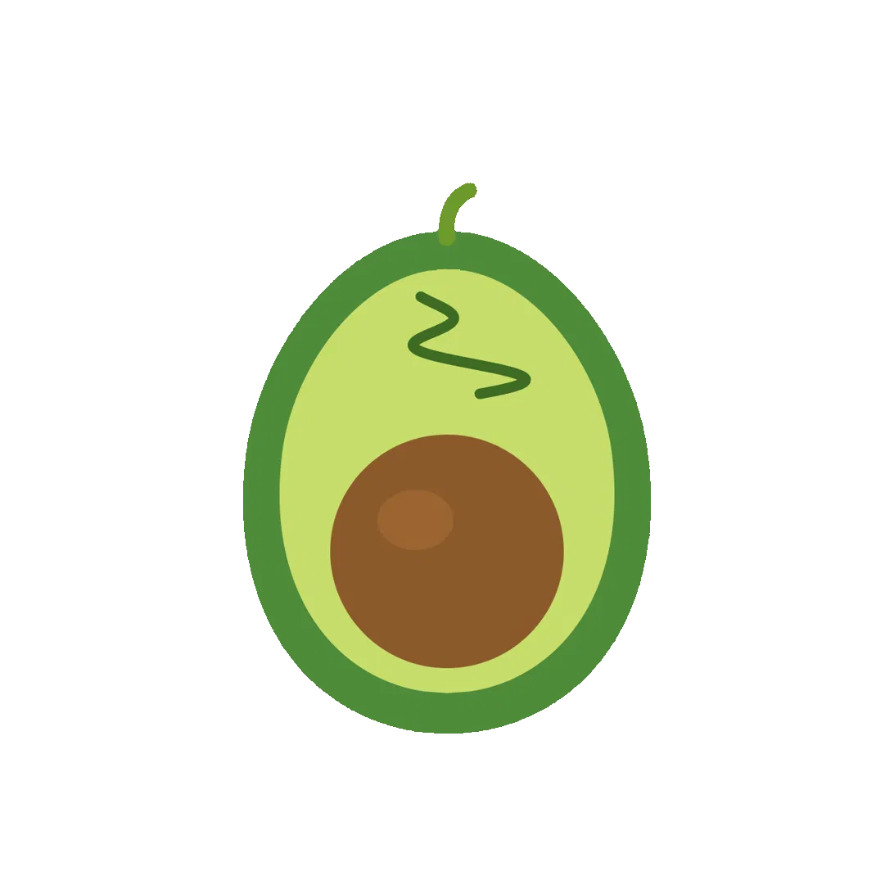

<p align="center">
  
</p>

<h1 align="center">LAVOCADO / 小油果</h1>

<p align="center">
  <strong>面向整个桌面的本地优先 AI 视觉保护工具。</strong>
</p>

<p align="center">
  <a href="README.md"><b>English</b></a> |
  <a href="README.zh.md"><b>中文</b></a>
</p>

---

LAVOCADO 是一款面向 **Windows 10/11 和 macOS** 的本地优先桌面保护应用。

与只依赖网站 URL 或应用名称的传统拦截工具不同，LAVOCADO 可以分析**屏幕上最终显示出来的像素内容**。视觉证据在本地处理，必要时会进行更高分辨率的复查，并通过多个新鲜帧进行确认，最终在对应显示器上显示干预界面。

LAVOCADO 面向**自我约束的戒色（self-directed abstinence）**场景——为那些真心决定远离色情与露骨内容的人而设计。它帮助你守住**自己主动设定的边界**，而不是家长管控或监视工具。它不只是简单拦截，而是把每一次触发都变成一个有意识的**暂停**，让你有机会打断冲动、重新选择接下来要做什么。

## 为什么需要 LAVOCADO？

不希望看到的视觉内容并不只会出现在特定网站中。

它可能出现在：

- 浏览器
- 社交和聊天应用
- 视频播放器
- 图片查看器
- 本地文件
- 多显示器环境

单纯依赖 URL 的拦截方式无法可靠覆盖这些场景。

LAVOCADO 将**用户自行配置的上下文规则**与**本地视觉 AI**结合起来，在整个桌面范围内执行用户主动设定的边界。

---

## 工作原理

LAVOCADO 将**用户意图**和**视觉判断**严格分开。

```text
前台应用 / 网站
      ↓
   上下文策略
      ↓
┌─────┼─────┐
↓     ↓     ↓
强制阻止 完全绕过 正常模式
↓     ↓     ↓
干预  跳过视觉AI 视觉检测
              ↓
           多帧确认
              ↓
             干预
```

规则优先级：

```text
FORCE_BLOCK > FULL_BYPASS > NORMAL
```

- **FORCE_BLOCK** — 当命中被阻止的应用或网站时，立即触发保护。
- **FULL_BYPASS** — 当处于用户信任的应用或网站时，暂时完全跳过视觉检测。
- **NORMAL** — 没有上下文规则覆盖时，正常运行视觉保护流程。

黑名单始终优先于白名单。

白名单适合用户明确信任的场景，例如医疗、教育、艺术、新闻等可能合理包含敏感人体内容的环境。

---

## 视觉保护流程

在正常模式下：

```text
屏幕捕获
   ↓
变化调度
   ↓
扫描规划
   ↓
NudeNet + YOLO11
   ↓
视觉证据
   ↓
ROI / Tile 复查
   ↓
候选目标跟踪
   ↓
新鲜帧多帧确认
   ↓
保护干预
```

LAVOCADO 不会因为单次较弱的模型结果就立即触发干预。

可疑区域可以：

- 从原始全分辨率画面重新裁剪
- 以更高分辨率 ROI 重新检测
- 通过 Tile 扫描恢复小目标
- 跨帧进行候选目标跟踪
- 使用独立的新鲜帧进行最终确认

这种方式可以提升召回率，而不是简单通过降低阈值来增加误报。

---

## AI 模型

LAVOCADO 使用固定版本并在本地验证的视觉模型：

- **NudeNet 640m** — 主要显式内容检测
- **YOLO11 NSFW Small** — 提供额外视觉证据
- **Viddexa Nano / Mini** — 用于视觉区域优先级排序

Viddexa 只负责帮助系统判断**下一步应该优先检查哪些区域**。

它不会直接触发保护。

---

## 干预流程

当视觉违规被确认后，LAVOCADO 会在对应显示器上显示干预界面：

```text
暂停
 ↓
呼吸
 ↓
准备
```

目标不仅是识别内容，而是在检测结果和用户下一步操作之间创造一个明确的中断。

---

## 可选 AI 打字冥想

在 Ready 阶段，可以选择启用 AI 辅助的打字冥想。

AI 陪伴功能可以：

- 根据当前会话内容进行回应
- 帮助用户思考接下来想做什么
- 引导一段简短的打字练习
- 支持英文和中文对话

AI 陪伴功能是可选的，并且独立于核心视觉保护流程。

LAVOCADO **不会自动向远程 LLM 发送**：

- 截图
- 检测标签
- 检测置信度
- 应用名称
- URL
- 窗口标题
- 浏览历史

远程 AI 请求可能包含：

- 当前会话
- 最近的打字练习文本
- 当天累计触发次数
- 粗粒度时间段信息

如果 AI 冥想被关闭、不可用或请求失败，LAVOCADO 会自动回退到本地固定引导。

AI 陪伴功能定位为支持性引导，不是心理治疗或医疗建议。

### 推荐配置

当前默认 / 推荐模型：

```text
gpt-4o-mini
```

可以在：

```text
Dashboard → Settings → AI typing meditation
```

中进行配置。

需要：

- API Key
- 兼容的 Chat Completions Endpoint
- 与当前请求格式兼容的模型

OpenAI API 费用与 ChatGPT 订阅相互独立。

关于服务商兼容性、API 参数、环境变量、错误排查和 API Key 存储方式，建议放到独立的 AI Meditation 文档中。

---

## 隐私

LAVOCADO 的设计原则之一，就是尽可能让敏感视觉数据留在本机。

### 屏幕数据

LAVOCADO 不会保存：

- 截图
- 图片裁剪
- 像素数据

视觉内容仅在本地处理，并只在必要时间内保留于内存中。

### 浏览器上下文

网站规则只保存规则所需要的标准化 hostname。

LAVOCADO 不会持久化：

- 完整 URL
- URL 路径
- 查询参数
- 窗口标题

### 保护历史

保护历史只保存有限的元数据，例如：

- 事件时间
- 触发类型
- 置信度
- 显示器编号
- 是否成功显示干预界面

规则触发事件不会变成浏览历史记录。

### AI 冥想

会话文本只保存在应用内存中，并与保护事件历史分离。

用户主动输入或粘贴到 AI 会话中的内容，可能会被发送给用户配置的 API 服务商。

保存的 API 凭证目前存储在本地应用设置中。不要提交或分享对应设置文件。

---

## 功能

- 本地视觉内容检测
- 多帧确认
- 多显示器状态隔离
- 应用黑名单和白名单
- 网站黑名单和白名单
- Context-first 上下文保护策略
- 高分辨率 ROI 复查
- Tile 小目标恢复
- 候选目标跨帧跟踪
- 本地 Dashboard
- 检测模式预设
- 本地模型管理
- 隐私安全的运行诊断
- 本地保护历史
- 可选 AI 打字冥想
- 中文 / 英文界面
- 离线模型验证
- 打包版本自检

---

## 支持平台

### Windows 10 / 11

- 原生桌面捕获
- 前台应用识别
- 通过 Windows UI Automation 获取浏览器上下文

### macOS

- ScreenCaptureKit
- 前台应用识别
- 通过 Accessibility API 获取浏览器上下文

在 macOS 上，请为 LAVOCADO 或运行它的终端授予：

- **System Settings → Privacy & Security → Screen & System Audio Recording**
- **System Settings → Privacy & Security → Accessibility**

屏幕录制权限是视觉保护所必需的。

Accessibility 权限用于识别前台应用和浏览器上下文。

---

## 快速开始

### 环境要求

- Python 3.12
- Windows 10/11 或 macOS

克隆项目：

```bash
git clone https://github.com/DurianBurger561/LAVOCADO.git
cd LAVOCADO
```

### Windows

```powershell
py -3.12 -m venv .venv
.\.venv\Scripts\Activate.ps1

python -m pip install --upgrade pip
python -m pip install -r requirements.txt

python scripts/download_models.py --model all
python main.py --self-check
python main.py dashboard
```

### macOS

```bash
python3.12 -m venv .venv
source .venv/bin/activate

python -m pip install --upgrade pip
python -m pip install -r requirements.txt

python scripts/download_models.py --model all
python main.py --self-check
python main.py dashboard
```

---

## 使用方式

直接启动保护：

```bash
python main.py
```

或者：

```bash
python main.py protect
```

打开 Dashboard：

```bash
python main.py dashboard
```

查看最近的隐私安全事件：

```bash
python main.py events --limit 20
```

运行本地健康检查：

```bash
python main.py --self-check
```

Dashboard 可以用于：

- 启动和停止保护
- 配置应用和网站规则
- 调整视觉检测设置
- 应用检测模式预设
- 管理本地模型
- 查看运行诊断
- 测试干预界面
- 查看最近事件
- 配置 AI 打字冥想

---

## 架构

```text
                    本地 Dashboard
                          │
                          ▼
                 Protection Controller
                          │
                       子进程
                          ▼
                    LavocadoService
                   /               \
               Context             Vision
                  │                  │
                  ▼                  ▼
            Context Policy      CaptureFrame
                  │                  │
        ┌─────────┼─────────┐        ▼
        ↓         ↓         ↓ ProtectionRuntime
     BLOCK      BYPASS    NORMAL      │
        │         │         │         ▼
        │         │         └──→ 视觉 Pipeline
        │         │                   │
        │         │                   ▼
        │         │                多帧确认
        │         │                   │
        └─────────┴───────────────────┘
                          │
                          ▼
                        干预
```

重要边界：

- Context 决定**是否运行 Vision**。
- Vision 只判断**屏幕上存在什么视觉证据**。
- Detector 只产生证据，不直接触发保护。
- Viddexa 只负责区域排序，不直接做 Block 决策。
- 多帧确认必须基于独立的新鲜帧。
- 不同显示器的视觉运行状态彼此隔离。
- 平台相关 API 被限制在 Platform Adapter 内。

---

## 稳定性与可复现性

LAVOCADO 将模型和打包资源视为产品的一部分。

```text
固定模型清单
     ↓
模型下载
     ↓
完整性验证
     ↓
离线运行验证
     ↓
PyInstaller 打包
     ↓
Frozen Self-Check
```

正式发布前会验证所需模型资源。

运行：

```bash
python main.py --self-check
```

可以检查本地或打包后的应用环境。

---

## 构建

安装构建依赖：

```bash
python -m pip install -r requirements.txt -r requirements-build.txt
```

下载所需模型：

```bash
python scripts/download_models.py --model all
```

构建：

```bash
python -m PyInstaller --noconfirm --clean lavocado.spec
```

生成的应用位于：

```text
dist/
```

Windows 和 macOS 需要分别在对应目标操作系统上构建。

---

## 测试

运行完整测试：

```bash
python -m unittest discover -s tests -v
```

---

## 项目结构

```text
LAVOCADO/
├── main.py
├── app/
│   ├── context/          # 前台应用/网站发现与策略
│   ├── intervention/     # 干预流程与本地事件历史
│   ├── platforms/        # Windows/macOS 平台实现
│   ├── settings/         # 类型化运行设置
│   ├── ui/               # Dashboard 与 Overlay
│   └── vision/           # 视觉 AI Pipeline
│
├── scripts/              # 模型下载与验证工具
├── tests/
├── lavocado_packaging/   # PyInstaller 公共打包辅助
└── lavocado.spec
```

---

## LAVOCADO 有什么不同？

| 能力                 | 仅 URL 拦截 | 单张图片 NSFW 分类器 | LAVOCADO |
| -------------------- | ----------: | -------------------: | -------: |
| 网站规则             |        支持 |               不支持 |     支持 |
| 应用规则             |        有限 |               不支持 |     支持 |
| 检测桌面最终像素     |      不支持 |                 支持 |     支持 |
| 本地视觉处理         |      不适用 |           视实现而定 |     支持 |
| 高分辨率局部复查     |      不支持 |           通常不支持 |     支持 |
| 新鲜帧多帧确认       |      不支持 |           通常不支持 |     支持 |
| 多显示器状态隔离     |      不支持 |                 很少 |     支持 |
| 用户控制的信任上下文 |        有限 |               不支持 |     支持 |
| 主动干预流程         |        有限 |               不支持 |     支持 |

---

## 设计原则

> **用户意图属于策略。
> 视觉判断属于 AI。
> 敏感的屏幕数据留在本机。**

LAVOCADO 的目标，是把用户主动设定的数字边界变成一个实际可用、注重隐私的桌面保护系统。
